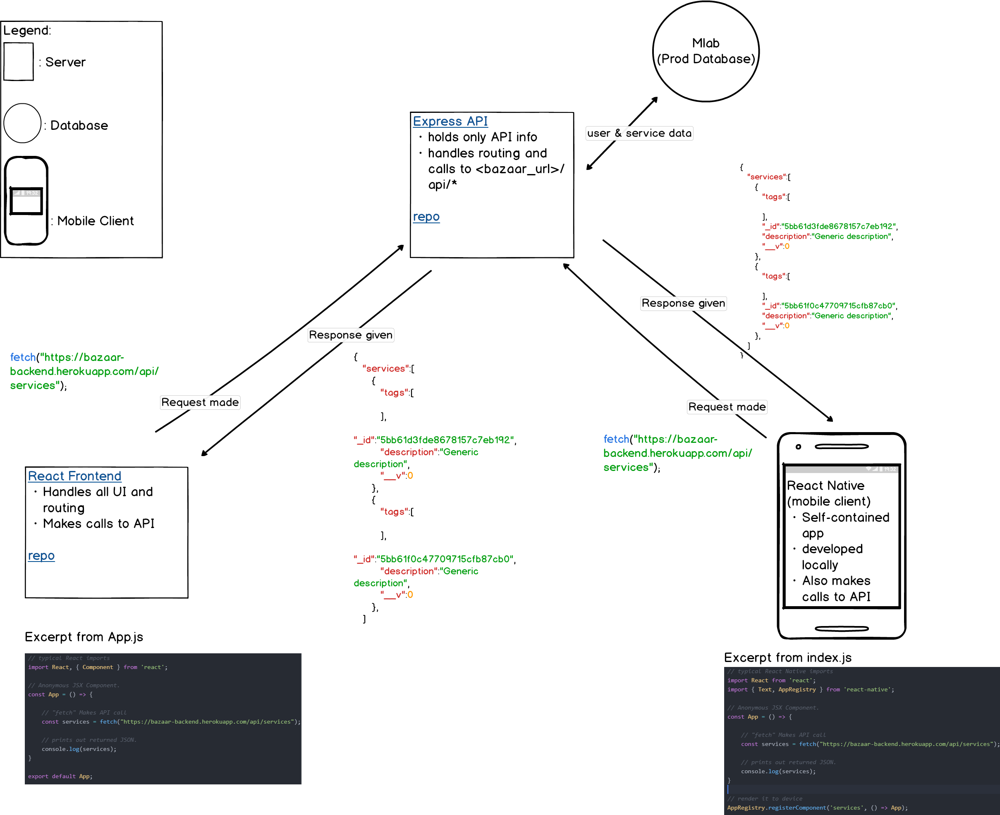

All,

Some quick updates as we head into the weekend.

# Bazaar: The Hydra

> Diagram I went over in lab today. Better view [here](bazaar_mockup.pdf): bazaar_mockup.pdf

The project has been split into 3 parts, each with its own repo. You can read about it [here](consolidation.md).

1. [bazaar-backend](https://github.com/steevejoseph/bazaar-backend) (formerly largo)
  * Url: https://bazaar-backend.herokuapp.com/
  * Repo: https://github.com/steevejoseph/bazaar-backend
  * Express app
  * Now only contains API.
  * Changelog:
    * routes/, views/, and public/ directories are obsolete.
      * (folders left in for quick debugging throughout duration of project)

2. [bazaar-frontend](https://github.com/steevejoseph/bazaar-frontend)
  * Url: https://bazaar-frontend.herokuapp.com/
  * Repo: https://github.com/steevejoseph/bazaar-frontend
  * React app
  * Handles all UI, application state and routing.
  * Makes calls to the API, then wraps the responding JSON.

3. [bazaar-mobile](https://github.com/steevejoseph/bazaar-mobile)
  * Self-contained app.
  * repo: https://github.com/steevejoseph/bazaar-mobile
  * Also makes calls to the API.

# Next Steps
For the past couple weeks, the main bottleneck has been finding a concrete way to integrate React into the project. Since that's been hashed out, we're gonna start ramping back up with getting views defined, making calls to our API, and rendering responses on our frontend.

* **Please be familiar with React by Tuesday**. At the least, be able to:
 * make/render components (both class and functional)
 * nest components
 * make requests w/ `fetch` (GET/POST)
 * manage component state
 * handle routes with react-router
 * pass props from parent components to children
 * manage app state

  
Feel free to PM for questions/comments/concerns.

Kind regards,  
Steeve
